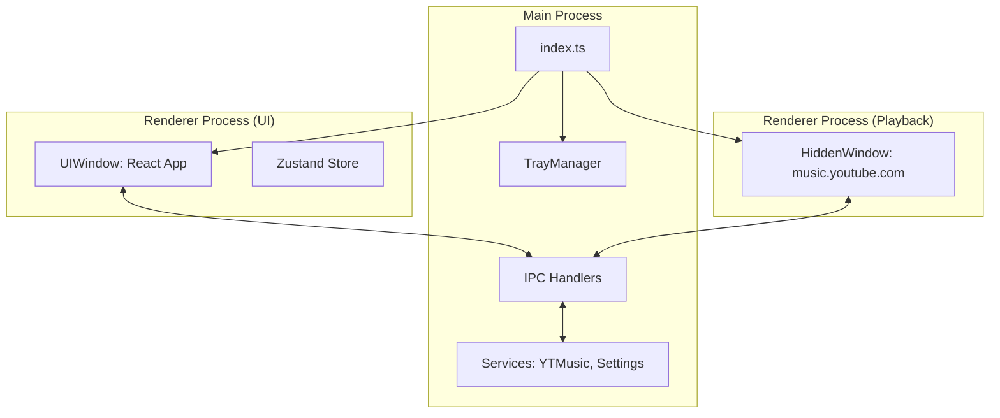

# silent Architecture

`silent` is a specialized macOS YouTube Music client designed to be minimal, keyboard-centric, and non-intrusive.

## High-Level Overview

The application is built with Electron, using a multi-window architecture to separate the user interface from the audio playback engine.



## Directory Structure

```text
.
├── assets/             # Branding assets (icons, screenshots)
├── docs/               # Feature plans and documentation
├── scripts/            # Utility scripts (e.g., screenshot automation)
├── src/
│   ├── main/           # Main process (Electron)
│   │   ├── ipc/        # IPC channel definitions and handlers
│   │   ├── services/   # Business logic (YTMusic, Settings)
│   │   ├── windows/    # Window creation logic (UI, Hidden, About)
│   │   └── index.ts    # App entry point
│   ├── preload/        # Preload scripts for renderer isolation
│   ├── renderer/       # UI (React)
│   │   ├── components/ # React components
│   │   ├── store/      # Zustand state management
│   │   ├── styles/     # Vanilla CSS
│   │   └── index.tsx   # Renderer entry point
│   └── shared/         # Shared types and utility constants
├── forge.config.ts     # Electron Forge configuration
└── webpack.*.config.ts # Build configurations
```

## Core Components

### 1. Main Process (`src/main`)
- **Entry Point (`index.ts`)**: Manages the application lifecycle, window creation, and native macOS menus.
- **Window Management**:
    - **UIWindow**: Handles the visual interface. Supports transparency, vibrancy, and "Skeleton" UI.
    - **HiddenWindow**: A headless window that loads `music.youtube.com`. It acts as the "playback engine" and interacts with the MediaSession API.
- **Services**:
    - `YTMusicService`: Wraps `youtubei.js` to fetch metadata, search results, and library info.
    - `SettingsService`: Manages persistent user preferences (Mode, Tray settings, etc.) using `electron-store`.
- **Managers**:
    - `TrayManager`: Manages the macOS menu bar icon, "Now Playing" scrolling text, and playback animations.
    - `ShortcutManager`: Registers system-wide global shortcuts for media control.

### 2. Renderer Process (`src/renderer`)
- **UI Architecture**: Built with React and styled with Vanilla CSS/PostCSS for transparency and glassmorphism.
- **State Management**: Uses `zustand` to sync playback state and user preferences across the UI.
- **Preload Scripts**: Provide a secure, bridge-based IPC communication between the renderer and the main process.

### 3. Communication (IPC)
- All communication between the UI and the Playback engine flows through the Main process via IPC.
- `src/main/ipc/handlers.ts` acts as the central hub for routing commands (play, pause, seek) and state updates (playback progress, metadata).

## Dual Display Mode

The app operates in one of two mutually exclusive modes:
1. **Menu Bar Mode (Default)**: The app resides only in the macOS menu bar. The UIWindow appears as a semi-transparent "Skeleton" overlay when the tray icon is clicked. Dock icon is hidden.
2. **Dock Mode**: The app behaves like a standard macOS application with a Dock icon and standard window behavior.

## Key Technologies
- **Electron**: Application framework.
- **React**: UI framework.
- **youtubei.js**: YouTube Music API client.
- **electron-store**: Configuration persistence.
- **framer-motion**: Fluid animations for the "silent" feel.
