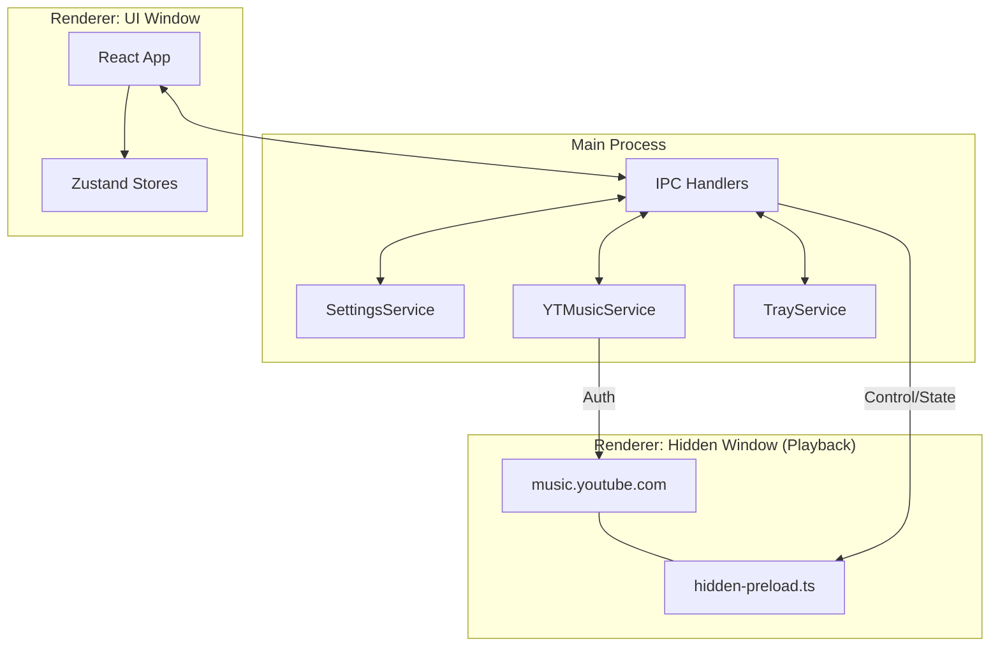

# Architecture of Silent

Silentは、macOS向けに最適化されたYouTube Musicデスクトップクライアントです。ミニマリズムと高いシステム統合性を実現するため、Electronのマルチプロセス・マルチウィンドウモデルを最大限に活用しています。

## 1. システム全体図

## 2. コア・コンセプト

### 2.1. Separation of Concerns (責務の分離)
- **UI Window**: ユーザーインターフェースのみを担当。データの永続化や実際の再生ロジックは持ちません。
- **Hidden Window**: 実際のYouTube Music Webサイトをバックグラウンドでロードし、オーディオ再生を担当します。
- **Main Process**: ウィンドウの制御、設定管理、および `youtubei.js` を使用したデータ取得サービスを提供します。

---

## 3. 主要コンポーネント

### 3.1. Main Process (Services)
- **YTMusicService / YTMusicClient**: `youtubei.js` をラップしたインフラ層。Electronの `Session` からクッキーを抽出し、認証済み状態でYouTube Music APIを叩きます。
- **SettingsService**: `electron-store` を使用した設定の永続化を担当。
- **TrayService**: macOSのメニューバー（Tray）とのやり取りを抽象化。

### 3.2. Hidden Window (Playback Brain)
- **Direct Web Loading**: 隠しウィンドウで `https://music.youtube.com` をロードします。
- **MediaSession Hook (`hidden-preload.ts`)**: 
    - `navigator.mediaSession.setActionHandler` をオーバーライドし、UIからの操作（Play/Pause/Next）を直接プレーヤーロジックに注入します。
    - `setInterval` によるポーリングで、再生位置、曲の長さ、メタデータを正確に取得し、IPC経由で通知します。

### 3.3. UI Window (Presentation)
- **React 19 & Framer Motion**: 高度なアニメーションとスムーズな遷移を提供。
- **Zustand**: `musicStore`, `navigationStore`, `playerStore` の3つのストアで状態を管理。
    - `playerStore` はIPC経由で送られてくる再生状態をリアルタイムにUIに反映します。

---

## 4. データ・フロー

### 4.1. 認証とAPI
1. ユーザーがログイン（必要時、メインプロセス経由で隠しウィンドウを表示して実行）。
2. `YTMusicClient` が `session.defaultSession.cookies` から `youtube.com` 関連のクッキーを収集。
3. `youtubei.js` (Innertube) のインスタンスを作成する際、これらのクッキーを渡すことで、ユーザー個別のプレイリストやおすすめを取得。

### 4.2. 再生制御の連鎖
1. **UI**: 「再生」ボタンをクリック。IPCで `YT_PLAY` 送信。
2. **Main**: 受信後、適切なYouTube Music URLを生成し、`HiddenWindow.loadURL()` を実行。
3. **Hidden**: 読み込み完了後、JavaScriptを実行して再生開始。
4. **Preload**: `MediaSession` の変化を検知し、IPC `PLAYBACK_STATE_CHANGED` を発行。
5. **Main**: メタデータの不足分（ArtistID等）を `YTMusicService` で補完し、すべてのUIウィンドウへブロードキャスト。
6. **UI**: 表示を最新の楽曲情報に更新。

---

## 5. テクニカルスタック

- **Runtime**: Electron
- **Language**: TypeScript
- **Frontend**: React, Framer Motion
- **State Management**: Zustand
- **API Interaction**: [youtubei.js](https://github.com/LuanRT/YouTube.js)
- **Styling**: Vanilla CSS, Tailwind CSS (Utility)
- **Build Tool**: Electron Forge, Webpack
- **Persistence**: `electron-store`
