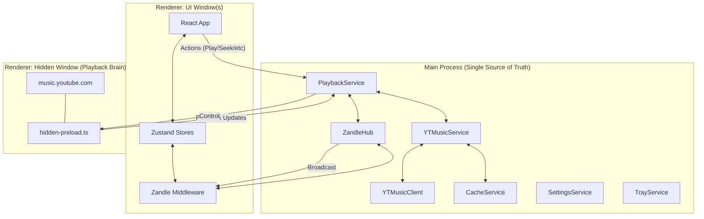

# Architecture of Silent

Silentは、macOS向けに最適化されたYouTube Musicデスクトップクライアントです。Electronのマルチプロセス・マルチウィンドウモデルを最大限に活用し、ミニマリズムと高いシステム統合性、そして快適なパフォーマンスを実現しています。

## 1. システム全体図

## 2. コア・コンセプト

### 2.1. Separation of Concerns (責務の分離)
- **UI Window**: ユーザーインターフェースのみを担当。状態の永続化や再生ロジックは持ちません。すべてのUIウィンドウは `ZandleHub` を介して同期されます。
- **Hidden Window**: `https://music.youtube.com` をバックグラウンドでロードし、オーディオ再生を担当。DOMからリアルタイムな再生情報を抽出します。
- **Main Process**: アプリケーションの「脳」として機能。サービス間の調整、API通信、状態の集約、および永続化を担当します。

### 2.2. Zandle Architecture (マルチウィンドウ同期)
複数のウィンドウ（メイン、ミニプレーヤー、設定など）間で状態をリアルタイムに同期するための独自プロトコルです。
- **ZandleHub**: メインプロセス側の調整役。変更を受信し、他のすべてのウィンドウにブロードキャストします。
- **Zandle Middleware**: Zustandのミドルウェアとして動作し、ストアの変更を自動的にIPC経由で同期・永続化します。

---

## 3. 主要コンポーネント

### 3.1. Main Process (Services)
- **PlaybackService**: 再生状態とメタデータの集約点（SSOT）。Hidden Windowからの不完全な情報を `YTMusicService` のAPIデータで補完（Enrichment）し、最終的な状態を決定します。
- **ZandleHub**: ウィンドウ間の状態同期を担当。ハイドレーション（新規ウィンドウへの初期状態提供）も行います。
- **YTMusicService / YTMusicClient**: 認証済みのYouTube Music API通信を提供。`youtubei.js` をラップしています。
- **CacheService**: `electron-store` でインデックス管理されたファイルベースの永続キャッシュ。メタデータ、画像、検索結果などを管理し、オフライン体験と高速化を支えます。
- **SettingsService**: `electron-store` を使用したユーザー設定の管理。

### 3.2. Hidden Window (Playback Brain)
- **Direct Web Loading**: 隠しウィンドウでGoogleが提供する公式プレーヤーをロードします。
- **MediaSession / DOM Hook (`hidden-preload.ts`)**: 
    - `navigator.mediaSession` への介入により、再生、一時停止、スキップなどのアクションを公式プレーヤーに注入します。
    - DOMのポーリングにより、再生位置、曲の長さ、DOMベースのメタデータを取得し、`PlaybackService` に通知します。

### 3.3. UI Window (Presentation)
- **React 19 & Framer Motion**: 高度に洗練されたUIと滑らかなアニメーションを提供。
- **Zandle-powered Zustand**: `playerStore`, `musicStore`, `likeStore`, `navigationStore` などのストアで状態を管理。`Zandle` ミドルウェアにより、すべてのウィンドウで同一の状態が維持されます。

---

## 4. データ・フロー

### 4.1. メタデータのエンリッチメント (Metadata Enrichment)
1. **Hidden**: DOMから楽曲タイトル、アーティスト名を取得（低精度）。
2. **Main (PlaybackService)**: videoIdを元に `YTMusicService` に問い合わせ。
3. **API**: 高解像度のアートワーク、正確なArtistID、AlbumID、Like状態を取得。
4. **PS**: DOM情報とAPI情報を統合（Enrichment）し、`ZandleHub` を介してUIに配信。

### 4.2. 再生制御の連鎖
1. **UI**: 再生ボタンをクリック（`YT_PLAY` IPC）。
2. **Main (PlaybackService)**: 
    - ローディング状態を即座に全ウィンドウにブロードキャスト。
    - 最適なYouTube Music URLを生成。
    - `HiddenWindow.loadURL()` を実行。
3. **Hidden**: 再生開始。DOM情報の更新を開始。
4. **Main (PlaybackService)**: 状態変化を検知し、APIからの詳細情報を補完してUIに通知。

---

## 5. テクニカルスタック

- **Runtime**: Electron
- **Architecture**: Multi-process with cross-window state sync (Zandle)
- **Frontend**: React 19, Framer Motion
- **State Management**: Zustand + Zandle middleware
- **API Interaction**: [youtubei.js](https://github.com/LuanRT/YouTube.js)
- **Storage**: File-based persistent cache (Metadata/Images), electron-store (Settings)
- **Styling**: Vanilla CSS, Tailwind CSS
- **Build Tool**: Electron Forge, Vite/Webpack
- **I18n**: i18next
