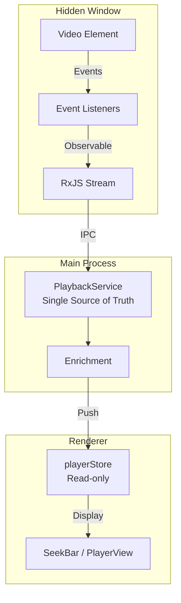

# Epic: RxJS + イベント駆動 + Main Process一元化によるプレイヤー同期改善

## 概要

現在のポーリングベースの同期を、**イベント駆動 + RxJS + Main Process一元化**の構成に移行し、同期問題を根本的に解消する。

---

## アーキテクチャ

---

## Epic 構成

| Epic | 内容 | 依存 |
|:---|:---|:---|
| Epic A | RxJS導入 + Hidden Windowイベント駆動化 | - |
| Epic B | PlaybackService作成 (Main Process一元化) | Epic A |
| Epic C | Renderer簡素化 + 補間ロジック整理 | Epic B |

---

## 期待される効果

- **レースコンディション排除**: `switchMap`で古いストリーム自動破棄
- **状態管理の明確化**: Main Processが唯一のソース
- **効率化**: ポーリング → イベント駆動で無駄なIPC削減
- **デバッグ容易化**: 状態の流れが一方向で追いやすい
