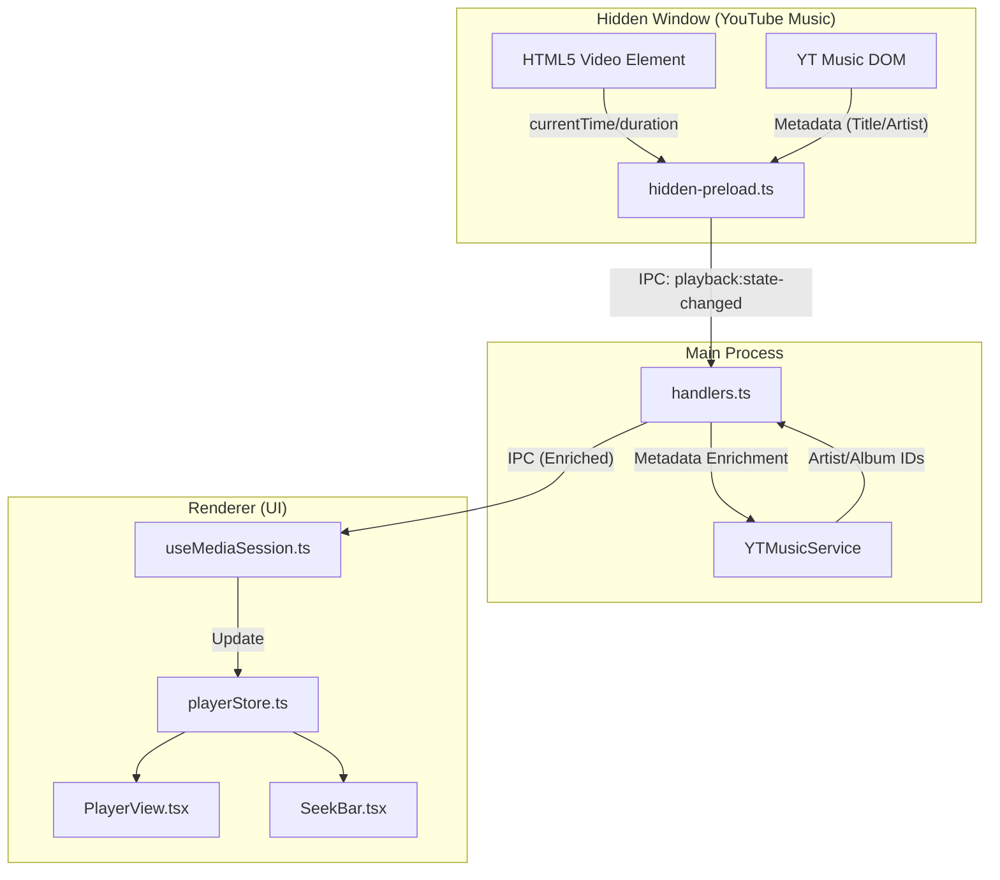

# プレイヤー同期メカニズムの現状分析

## 概要

Silentにおける隠しウィンドウ（YouTube Music）とUI側のプレイヤー表示の間で、同期がうまくいかない事象が発生している。

### 観測されている問題

1.  **ロードが長く、次の曲に遷移できない**
2.  **シークバーが連動しない** (曲が移動したタイミングで0:00に戻らない、曲の長さを突き抜ける等)

---

## アーキテクチャ

再生状態の同期は、**Hidden Window → Main Process → Renderer** の3層構造。

---

## 各コンポーネントの役割

| コンポーネント | ファイル | 役割 |
| :--- | :--- | :--- |
| **Poller (Source)** | `hidden-preload.ts` | 100ms周期でDOMとVideo要素から生データを抽出。`videoId`変化を検知してリセット信号を送出。 |
| **Bridge (Enricher)** | `handlers.ts` | 受信した情報を全ウィンドウへ転送。APIからの「正解データ（`referenceDuration`等）」で値を補正。 |
| **Store** | `playerStore.ts` | アプリ全体の再生状態を保持するZustandストア。 |
| **Interpolator (View)** | `SeekBar.tsx` | 100msポーリングを補完するため、`requestAnimationFrame`による滑らかな補間計算を行う。 |

---

## 同期タイミング

1.  **定期送信**: 100msごとに状態チェック。重要な変化時にIPCを送信。
2.  **即時リセット**: `videoId`変化時、`position: 0`のリセット情報を即座に送信。
3.  **メタデータ補完**: Mainプロセスが詳細情報を取得完了後、再度更新情報を送信。

---

## 同期手法

-   **ポーリング & プッシュ**: 隠しウィンドウが能動的に情報を吸い上げ、上流へプッシュ。
-   **補間 (Interpolation)**: UI側では100msの間隔を埋めるため、独自に時間を進める。
-   **境界ガード**: Mainプロセス側で公式曲長（`referenceDuration`）をキャップとして使用。

---

## 問題原因の推測

### 問題1：ロードが長い / 次の曲に遷移できない

| 原因 | 詳細 |
| :--- | :--- |
| `block_updates`の居残り | ナビゲーション開始時に`true`になり、ポーリング停止。解除イベントが発火しないと「Loading」のまま更新を受け取れなくなる。 |
| YouTube自動再生ブロック | YouTube側のスクリプトで再生が止まることがある。 |
| APIリクエスト競合 | URLロードと`getSongDetails`が同時に走り、遅延が発生。 |

### 問題2：シークバーが連動しない / 突き抜ける

| 原因 | 詳細 |
| :--- | :--- |
| 状態更新のレースコンディション | 曲が変わった後、一瞬だけ旧曲の再生位置が送られてUI側のリセット処理を上書き。 |
| `referenceDuration`のリセット漏れ | 新曲に切り替わった瞬間にクリアされていないと、新曲の`position`を旧曲の短い`duration`でキャップしてしまう。 |
| 補間ロジックのドリフト | `duration`が0の時に補間が止まっていない、または`duration`の更新が遅れている。 |
