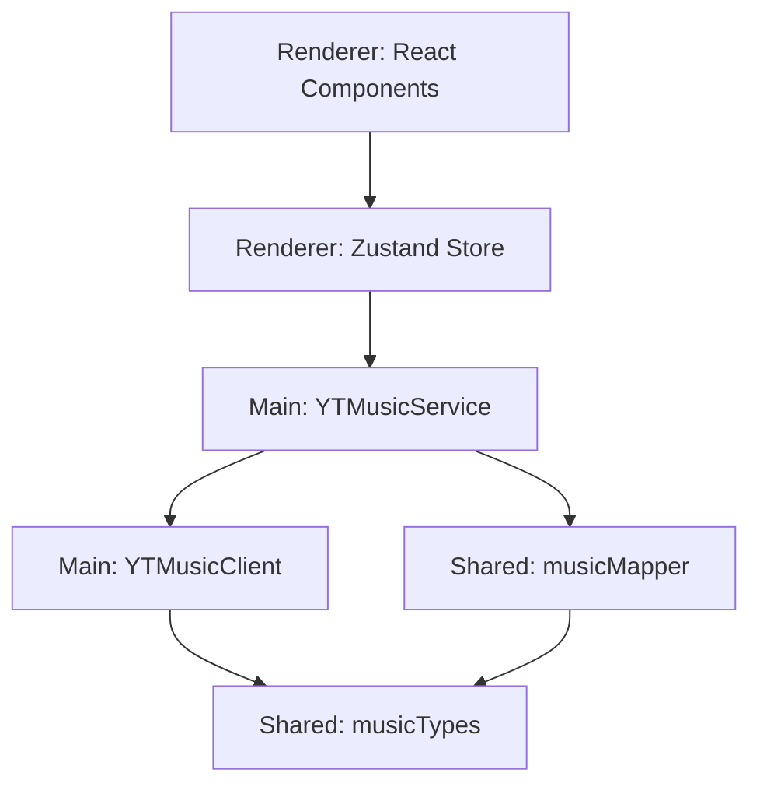

# Music Re-architecture Plan

このドキュメントは、`silent` における音楽データ構造（Types）と、それに関連するレイヤー構造（Architecture）の再設計方針をまとめたものです。

## 1. 現状の課題と目的

### 課題
- **型の不確実性**: `MusicItem` が巨大な単一の型として定義されており、多くのフィールドが optional であるため、利用側で常に型ガードや null チェックが必要。
- **責務の集中**: `YTMusicService` が API 通信、パース、キャッシュ、ビジネスロジックのすべてを担っており、メンテナンス性が低下している。
- **テストの困難さ**: マッピングロジックがサービス内にハードコードされており、ロジック単体でのテストが難しい。

### 目的
- **堅牢な型システム**: Discriminated Unions を導入し、型安全なコードベースを実現する。
- **明確なレイヤー分離**: クリーンアーキテクチャの考え方を取り入れ、基盤（API）、ドメイン（モデル/変換）、サービス（応用）の責務を分ける。
- **保守性の向上**: 各コンポーネルを小さく保ち、変更の影響範囲を局所化する。

## 2. 新しいレイヤー構造



### 各レイヤーの責務

| レイヤー | コンポーネント | 責務 |
| :--- | :--- | :--- |
| **Infrastructure** | `YTMusicClient.ts` | `youtubei.js` のラップ、認証、生データの取得。 |
| **Domain (Shared)** | `musicTypes.ts` | アプリケーション全体の共通言語となるモデル定義。 |
| **Domain (Shared)** | `musicMapper.ts` | 生データからドメインモデルへの純粋な変換（Pure Function）。 |
| **Service (Main)** | `YTMusicService.ts` | クライアントとマッパーを組み合わせた検索・取得・キャッシュ管理。 |
| **Presentation** | `Renderer Components` | 整理されたドメインモデル（MusicItem）に基づいた UI 表示。 |

## 3. 具体的な変更内容

### 3.1 厳密なエンティティ定義 (Discriminated Unions)

`MusicItem` を単一のインターフェースから、`type` フィールドに基づいた厳密な型の合併（Discriminated Unions）へと変更します。これにより、タイプごとに「何が必須で何が不要か」を型レベルで担保します。

#### 共通ベース定義
```typescript
export type ItemType = 'SONG' | 'ALBUM' | 'PLAYLIST' | 'ARTIST' | 'CHART' | 'RADIO';

export interface MusicThumbnail {
    url: string;
    width: number;
    height: number;
}

export interface MusicArtist {
    name: string;
    id?: string; // アーティスト詳細ページへのリンク用（必須ではない場合がある）
}

interface BaseMusicItem {
    type: ItemType;
    title: string;
    thumbnails: MusicThumbnail[];
    secondary_text?: string; // UI表示用のサブテキスト（アーティスト名や再生数など）
}
```

#### エンティティ別定義
| タイプ | 必須識別子 | 特徴 |
| :--- | :--- | :--- |
| `SONG` | `youtube_video_id` | 単一の楽曲。再生可能。 |
| `ALBUM` | `youtube_browse_id` | アルバム。トラックリストを持つ。 |
| `PLAYLIST` | `youtube_playlist_id` | ユーザーまたは公式プレイリスト。 |
| `ARTIST` | `youtube_browse_id` | アーティスト。楽曲やアルバムを包含。 |
| `CHART` | `youtube_playlist_id` | ランキング。本質的にはプレイリストの一種。 |
| `RADIO` | `youtube_playlist_id` | 楽曲ベースのステーション（Mix等）。 |

```typescript
export interface SongItem extends BaseMusicItem {
    type: 'SONG';
    youtube_video_id: string; // 必須: 再生に必要
    artists: MusicArtist[];  // id は極力含める
    album?: {
        name: string;
        youtube_browse_id: string; // アルバム詳細へのリンク用
    };
    duration?: {
        text: string;
        seconds: number;
    };
}

export interface AlbumItem extends BaseMusicItem {
    type: 'ALBUM';
    youtube_browse_id: string;
    artists: MusicArtist[];
    year?: string;
}

export interface PlaylistItem extends BaseMusicItem {
    type: 'PLAYLIST';
    youtube_playlist_id: string;
    author?: string;
    item_count?: number;
}

export interface ArtistItem extends BaseMusicItem {
    type: 'ARTIST';
    youtube_browse_id: string;
}

export interface ChartItem extends BaseMusicItem {
    type: 'CHART';
    youtube_playlist_id: string; // チャートは通常プレイリストIDで管理される
}

export interface RadioItem extends BaseMusicItem {
    type: 'RADIO';
    youtube_playlist_id: string; // Mix等はRDから始まるプレイリストID
}

export type MusicItem = SongItem | AlbumItem | PlaylistItem | ArtistItem | ChartItem | RadioItem;
```

### 3.2 IDの体系とデータ正規化

YouTube Musicのデータ構造には複数のIDが存在し、用途によって使い分ける必要があります。

| IDの種類 | 定義名 | 目的 | 役割 |
| :--- | :--- | :--- | :--- |
| **Playback ID** | `youtube_video_id` | **再生** | 実際に楽曲を再生するために必須の識別子。 |
| **Navigation ID** | `youtube_browse_id` | **詳細取得** | アルバムやアーティストの「一覧ページ」をAPIから取得。 |
| **Navigation ID** | `youtube_playlist_id` | **詳細取得/再生コンテキスト** | プレイリストの一覧取得、および継続再生用コンテキスト。 |

#### マッパー層での正規化方針
- **Artist IDの徹底**: `SongItem` 等に含まれる `MusicArtist` は、可能な限り `id` (browse_id) を保持するようにマッパーで補完します。
- **Context IDの明示**: プレイリストやアルバム内での再生時には、`youtube_playlist_id` を再生コンテキストとして常に引き回します。
- **IDのプレフィックスによる型推論**: プレフィックス（`MPRE`, `UC`, `PL`, `RD` 等）に基づいた厳密な型判定を行い、`UNKNOWN` を排除します。

### 3.3 状態管理とナビゲーションの改善 (Zustand)

これまで `App.tsx` の `useState` で管理していたUI状態を Zustand ストアへ移行し、堅牢なナビゲーションとデータキャッシュを実現します。

#### 1. `navigationStore`: ページ遷移の集中管理
- **履歴管理 (Stack-based)**: `viewStack` をストアで管理し、`push`, `pop`, `reset` などのアクションを定義します。ブラウザの「戻る」挙動に近い直感的な遷移を保証し、`flaky` な挙動を排除します。
- **遷移ガード**: 重複した遷移（同じアルバムを二度開くなど）をストア側で防ぎます。
- **URL-like なルーティング**: 各画面に一意の識別子（`home`, `album/:id`, `artist/:id` 等）を割り振り、外部（外部プロセス等）からのディープリンクにも対応可能な設計にします。

#### 2. `dataCacheStore`: 重複リクエストの削減
- **一貫性のあるキャッシュ**: 取得したアルバム詳細（`AlbumItem`）やアーティスト詳細（`ArtistItem`）を ID をキーに保存します。
- **メモリ内キャッシュ**: 詳細画面を開く際、既にストアにデータがある場合は即座に表示し、バックグラウンドで最新化（SWR: Stale-While-Revalidate）することで、体感速度を向上させ、不要な API リクエストを削減します。
- **正規化されたデータ保持**: 楽曲、アルバム、アーティストを個別のエンティティとして保持し、データの一貫性を保ちます。

#### 3. `playerStore`: 再生状態の同期
- 現在の再生楽曲、再生状態（isPlaying, progress）を管理。`HiddenWindow` との正確な同期を担います。

これにより、`PlayerView` や `SearchBar` からの遷移などのバケツリレーを完全に排除し、アプリケーション全体のどこからでも安全にナビゲーションとデータアクセスが可能になります。

### 3.4 ディレクトリ構成の整理
```text
src/
  ├── main/
  │   ├── infrastructure/
  │   │   └── YTMusicClient.ts   [NEW] (youtubei.js のラッパー)
  │   └── services/
  │       └── YTMusicService.ts  [REFRACTOR] (インフラとマッパーの統合)
  ├── shared/
  │   ├── types/
  │   │   └── music.ts           [REFRACTOR] (上記 Discriminated Unions)
  │   └── mappers/
  │       └── musicMapper.ts     [NEW] (APIデータ -> MusicItem 変換)
```

## 4. 期待される効果
1.  **ランタイムエラーの削減**: `item.type === 'SONG'` のブロック内では `youtube_video_id` が確実に存在することが保証される。
2.  **マッパーの純粋化**: YouTube API の型がどれほど複雑でも、マッパー内でこの厳密な型に「押し込める」ことで、アプリケーション本体をクリーンに保てる。
3.  **UIコンポーネントの単純化**: IDの選別ロジック（`App.tsx`など）が型ガードによって安全かつ簡潔になる。
